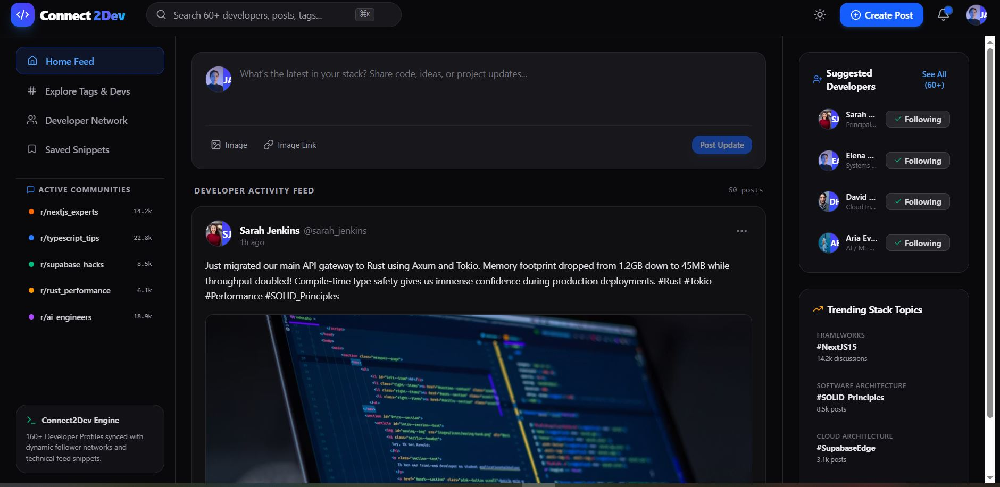
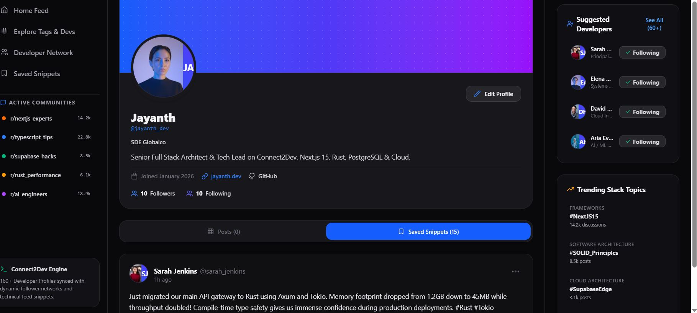
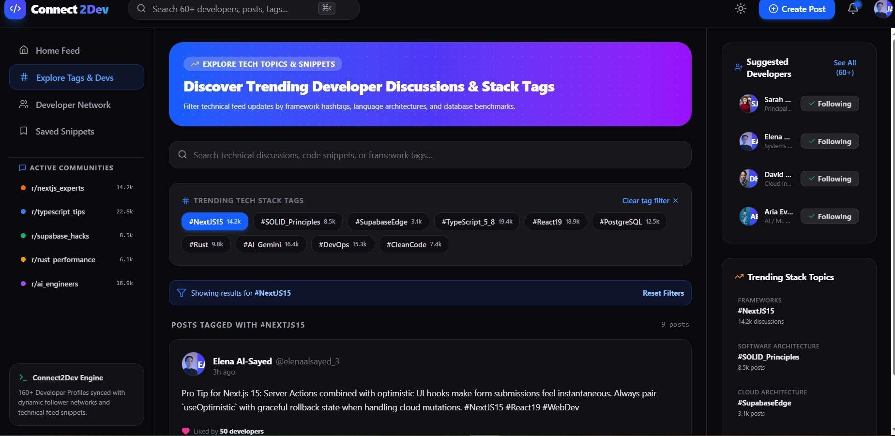
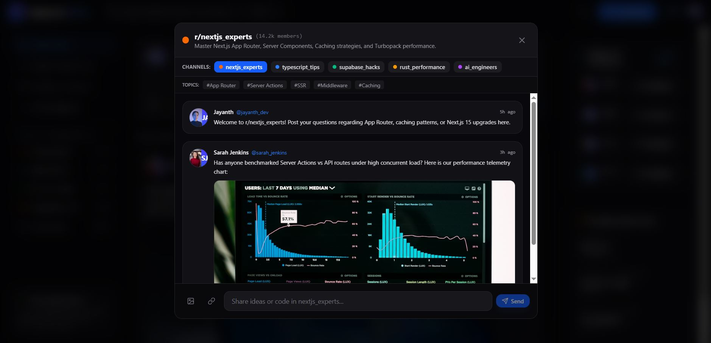
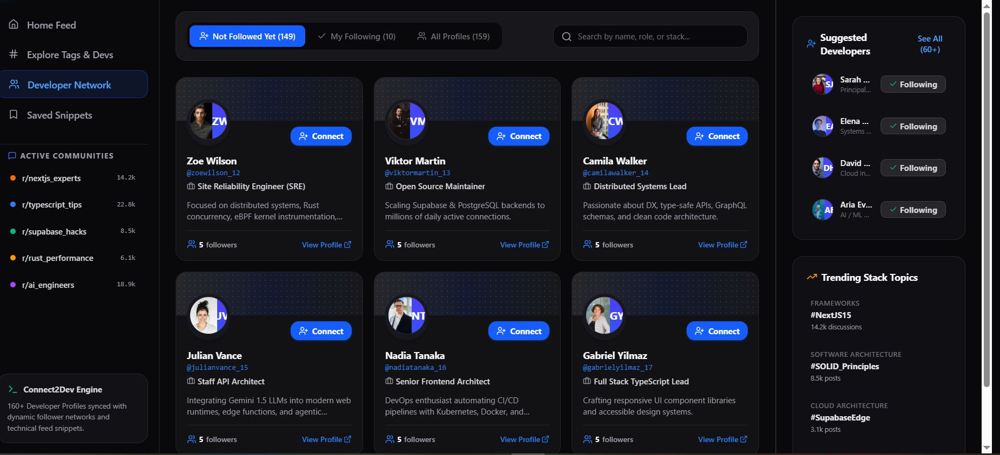

# 🚀 Connect2Dev

> **A Modern Developer-Centric Social Networking Platform**


---

## 📖 Overview

Connect2Dev is a modern social networking platform designed specifically for software developers, engineers, architects, and technology enthusiasts.

The platform enables developers to showcase projects, share technical knowledge, connect with professionals, participate in community discussions, and build a professional developer identity.

The project demonstrates modern frontend engineering practices including responsive UI design, reusable component architecture, TypeScript, GitHub Actions CI, and automated deployment using Vercel.

---

## 🌐 Live Demo

**Application**

https://connect2dev.vercel.app

**GitHub Repository**

https://github.com/jayanth618/connect2dev

---

# ✨ Features

## 📰 Developer Feed

- Create developer-focused posts
- Edit and delete your own posts
- Share code snippets
- Upload images
- Like and unlike posts
- Comment on posts
- Bookmark posts
- View pinned posts

---

## 👤 Developer Profile

- Update profile information
- Change avatar
- Professional title
- Bio
- Portfolio link
- GitHub profile
- Followers & Following

---

## 🤝 Developer Network

- Discover developers
- Send connection requests
- Accept or decline invitations
- Search developers
- Browse professional profiles

---

## 🔍 Explore

- Trending technologies
- Technology tags
- Developer communities
- Topic discovery
- Search developers

---

## 💬 Community

- Community discussion rooms
- Technical conversations
- Developer collaboration

---

## 🌙 User Experience

- Responsive Design
- Dark Mode
- Light Mode
- Mobile Friendly
- Sticky Navigation
- Smooth Animations

---

# 🛠 Technology Stack

| Category | Technology |
|-----------|------------|
| Frontend | React 19 |
| Language | TypeScript |
| Build Tool | Vite |
| Styling | Tailwind CSS v4 |
| Icons | Lucide React |
| Animations | Motion |
| AI | Google Gemini SDK |
| Storage | Local Storage |
| Optional Backend | Supabase |

---

# 📁 Project Structure

```text
connect2dev/
├── public/
├── src/
│   ├── components/
│   │   ├── auth/
│   │   ├── common/
│   │   ├── community/
│   │   ├── explore/
│   │   ├── feed/
│   │   ├── network/
│   │   ├── profile/
│   │   └── search/
│   │
│   ├── context/
│   ├── data/
│   ├── hooks/
│   ├── services/
│   ├── assets/
│   ├── utils/
│   ├── types.ts
│   ├── App.tsx
│   ├── main.tsx
│   └── index.css
│
├── .github/
│   └── workflows/
│       └── deploy.yml
│
├── package.json
├── vite.config.ts
├── tsconfig.json
└── README.md
```

---

# 🚀 Installation

Clone the repository

```bash
git clone https://github.com/jayanth618/connect2dev.git
```

Navigate to the project

```bash
cd connect2dev
```

Install dependencies

```bash
npm install
```

Run the application

```bash
npm run dev
```

Build for production

```bash
npm run build
```

Preview production build

```bash
npm run preview
```

---

# ⚙️ CI/CD

This project includes a GitHub Actions Continuous Integration workflow.

The workflow automatically:

- Runs on every push to the `main` branch
- Installs project dependencies
- Builds the application
- Verifies successful production compilation

The application is automatically deployed through **Vercel**, ensuring the latest version is available after each successful deployment.

---

## 📸 Screenshots

## 📰 Home Feed



---

## 👤 Developer Profile



---

## 🔍 Explore Page



---

## 💬 Community Chat



---

## 🤝 Network Tab



---
# 🚀 Future Enhancements

- GitHub Authentication
- Google Authentication
- Real-time Messaging
- Push Notifications
- AI Code Review
- Video Meetings
- Portfolio Verification
- Backend Integration
- Real-time Database

---

# 👨‍💻 Author

**Jayanth Kumar**

GitHub

https://github.com/jayanth618

---

## 📄 Project Purpose

This project was developed as part of a **Software Developer Technical Assessment** to demonstrate modern frontend development, component-based architecture, responsive UI design, GitHub Actions CI, and Vercel deployment.
